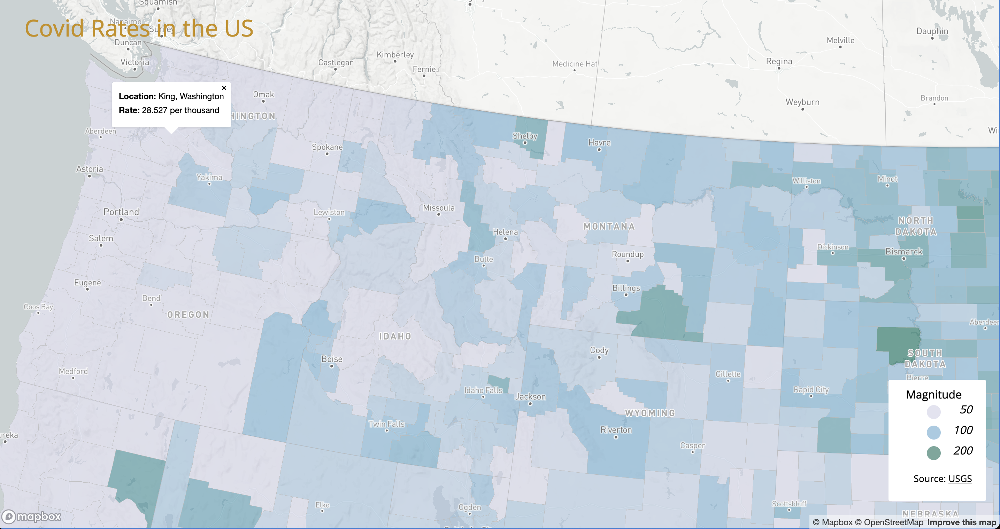
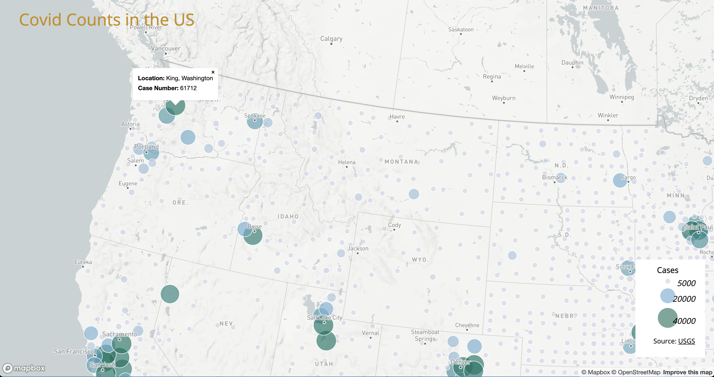

# Covid Maps
## Geog 458 lab 3
In this project, I created two maps to visualize the covid counts and rates for each county in the US. Both maps allow you to click on each county for detailed information. You can also zoom in/out to look for a particular area.

[Covid Rates](./map1.html)

[Covid Counts](./map2.html)

Data Source: The COVID-19 case/death data is from [New York Times](https://github.com/nytimes/covid-19-data/blob/43d32dde2f87bd4dafbb7d23f5d9e878124018b8/live/us-counties.csv)
The population data used for calculating the case rates are from the 2018 [ACS 5 year estimates](https://data.census.gov/cedsci/table?g=0100000US%24050000&d=ACS%205-Year%20Estimates%20Data%20Profiles&tid=ACSDP5Y2018.DP05&hidePreview=true)
The U.S. county boundary shapefile was downloaded from [the U.S. Census Bureau](https://www.census.gov/geographies/mapping-files/time-series/geo/carto-boundary-file.html)